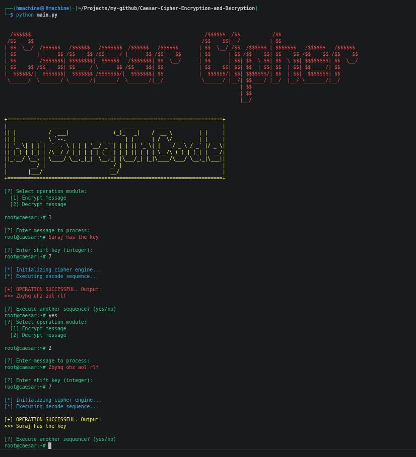

# Caesar Cipher: Encryption and Decryption


[](LICENSE)


This Python program allows users to encrypt and decrypt text using the Caesar cipher, a straightforward substitution cipher where each letter in the message is shifted by a fixed number of positions in the alphabet. It now features an immersive, **hacker-themed command-line interface!**

## 📸 Execution Screenshot

<div align="center">
  
</div>

## 🧠 Methodology

The Caesar cipher is one of the simplest and most widely known encryption techniques. It is a type of substitution cipher in which each letter in the plaintext is replaced by a letter some fixed number of positions down the alphabet. 

- **Encryption Formula:** `E_n(x) = (x + n) % 26`
- **Decryption Formula:** `D_n(x) = (x - n) % 26`

*(Where `x` is the character position, and `n` is the shift key)*

Our implementation is robust: it preserves uppercase and lowercase letters and ignores non-alphabetic characters (like spaces and punctuation), leaving them exactly as they were.

## ✨ Features

- **Encryption:** Secure your messages by shifting each letter using a chosen key.
- **Decryption:** Easily reverse the process using the same key to reveal the original message.
- **Case Sensitivity:** Works seamlessly with both uppercase and lowercase letters.
- **Hacker Aesthetic:** Enjoy a retro terminal feel with color-coded syntax (`root@caesar:~#`).
- **Visual Clarity:** Displays encrypted output in **Red** and decrypted output in **Yellow** for instant readability.

## 🚀 How to Use

1. Clone this repository to your local machine.
2. Run the Python script from your terminal:

   ```bash
   python main.py
   ```

3. Select the operation module:
   - Enter `1` to **encrypt** a message.
   - Enter `2` to **decrypt** a message.
4. Input your message when prompted.
5. Enter the shift value (integer). The script safely handles large numbers by wrapping them around the alphabet dynamically.
6. View the result and execute another sequence if desired!

## 💡 Example Usage

```text
[?] Select operation module:
  Encrypt message
  Decrypt message

root@caesar:~# 1

[?] Enter message to process:
root@caesar:~# Secret Payload!

[?] Enter shift key (integer):
root@caesar:~# 5

[*] Initializing cipher engine...
[*] Executing encode sequence...

[+] OPERATION SUCCESSFUL. Output:
>>> Xjhwjy Ufdqtfi!
```

## 🤝 Contributions

Contributions and feedback are welcome! Fork this repository and submit pull requests to improve the program.

## 📜 License

This project is available under the [MIT License](LICENSE).

## SurajInCode